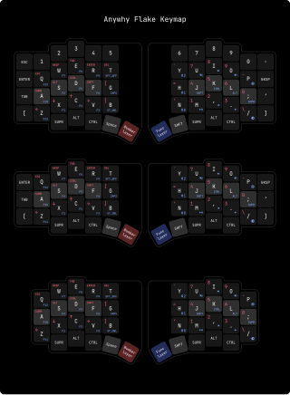

# Anywhy Flake Firmware

> **Important**: If you have a board version prior to 1.0, you should use the cofing from Flake_v0.1/v0.2 [branch](https://github.com/anywhy-io/flake-zmk-module/tree/Flake_v0.1/v0.2) and [actions](https://github.com/anywhy-io/flake-zmk-module/actions?query=branch%3AFlake_v0.1%2Fv0.2).

